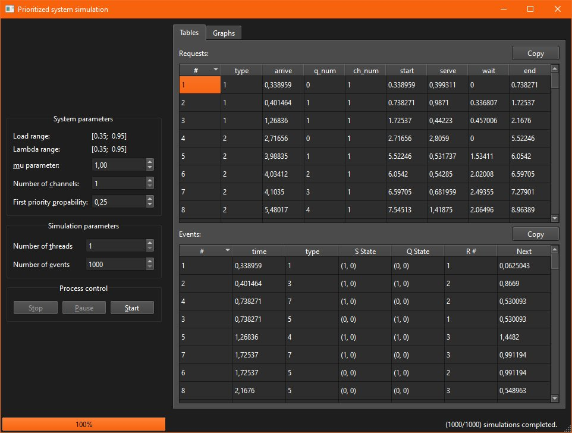
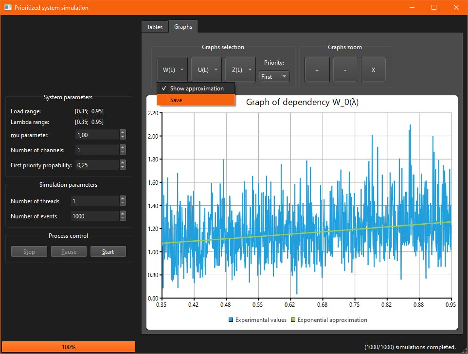

# GradWorkGUI

## Задача

Учебный проект по созданию графического приложение. Практического применения не имеет 
(приложение было актуально в 2018 году для отрисовки графиков, которые бы пошли в выпускную работу).

Старый код, используемый в выпускной работе помещён в подпроект *QueSys* после тщательного рефакторинга 
и переосмысления.

Задача заключалась в создании графического приложения, которое предлагало бы пользователю удобный ввод 
параметров СМО и симуляции и вывод результатов с возможностью сохранения.

## Результат

В результате разработан проект Qt Widgets, реализующий ввод параметров симуляции работы СМО, 
контролем выполнения симуляции, отслеживанием хода симуляции и отображения результатов (доступен экспорт).

## Скриншоты

